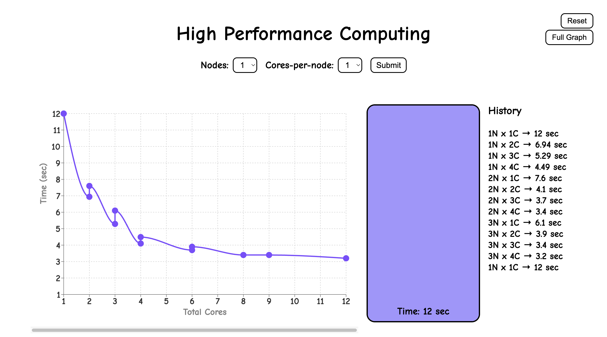
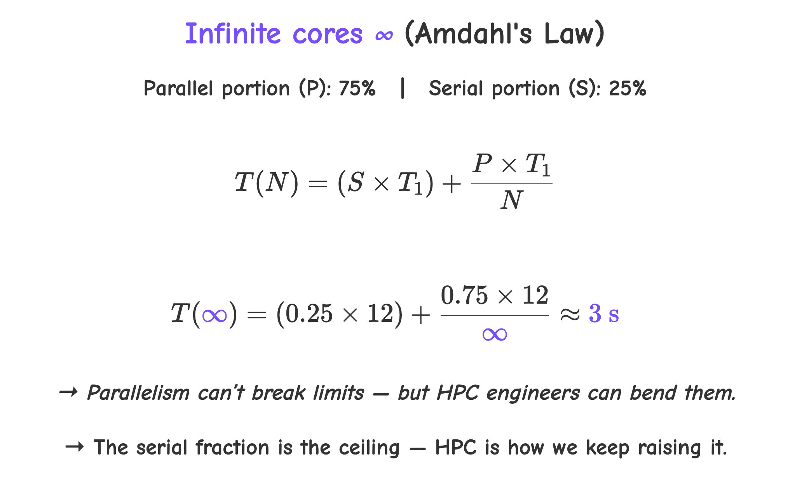

# parallel-bucket-visualizer
Interactive tool to visualize serial vs parallel processing in HPC

## Time vs Cores

| Nodes and cores | Time (sec) | 
| --------------- | ---------- | 
| 1N X 1C         |     12     | 
| 2N X 1C         |     8      | 
| 1N X 2C         |     7.5    | 
| 3N X 1C         |     6.5    | 
| 1N X 3C         |     6      | 
| 2N X 2C         |     5.5    | 
| 1N X 4C         |     5      | 
| 3N X 2C         |     4      | 
| 2N X 3C         |     3.8    | 
| 2N X 4C         |     3.2    | 
| 3N X 3C         |     3.0    | 
| 3N X 4C         |     2.8    | 

## TODO

- Fix delay in animation and LEDs toggling.
- Keep the submit button disabled until everything is done
- Make the flow robust so it doesn't break when someone clicks so many things at once
- Check fronted portability on another laptop

