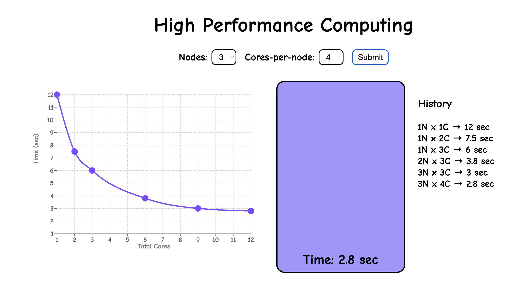

# parallel-bucket-visualizer
Interactive tool to visualize serial vs parallel processing in HPC

## Time vs Cores

| Nodes and cores | Time (sec) | 
| --------------- | ---------- | 
| 1N X 1C         |     12     | 
| 2N X 1C         |     8      | 
| 1N X 2C         |     7.5    | 
| 3N X 1C         |     6.5    | 
| 1N X 3C         |     6      | 
| 2N X 2C         |     5.5    | 
| 1N X 4C         |     5      | 
| 3N X 2C         |     4      | 
| 2N X 3C         |     3.8    | 
| 2N X 4C         |     3.2    | 
| 3N X 3C         |     3.0    | 
| 3N X 4C         |     2.8    | 

## TODO

- Increase graph size
- Keep the LED stay ON for 10s after animation is finished for the users to see
- Modify times to show better graph structure as it plateaus
- Connect Macbook to Pi cluster's network switch to bypass internet need
